# Movie Preference Warehouse Design

## Purpose and boundaries

The warehouse integrates two independently maintained sources:

1. MovieLens 20M supplies ratings, user-applied tags, movie titles/genres,
   source IDs, and tag-genome relevance scores.
2. Wikidata supplies additional movie description metadata, matched using the
   IMDb identifier in MovieLens `links.csv`.

The MovieLens CSV files are related extracts from one publisher and count as
one source. Wikidata is the second source. The raw MovieLens files remain
unchanged under `ml-20m/`; staging and warehouse outputs belong under `data/`.
The 5-million-record scale requirement is met by MovieLens ratings and is
separate from the multi-source integration requirement.

## Architecture

```text
MovieLens CSVs ─┐
                ├─> source staging + audit ─> conformed dimensions/facts ─> OLAP and mining
Wikidata API ───┘
```

Keep source IDs and retrieval details in staging for lineage. Normalize IMDb
IDs to the `tt` + seven-digit form before matching to Wikidata property P345.
Retain every MovieLens movie even when no Wikidata item is found; report
matched, unmatched, and ambiguous IDs separately. Do not substitute Wikidata
aggregate ratings for MovieLens rating events.

## Fact grains and dimensional model

| Table | One row represents | Measures / identifiers |
| --- | --- | --- |
| `fact_rating` | One MovieLens user rating of one movie at one recorded Unix timestamp | Rating value; source row identifier retained as a degenerate lineage dimension |
| `fact_tag` | One user-applied tag to one movie at one recorded Unix timestamp | Tag application event; source row identifier retained for lineage |
| `fact_genome_score` | One MovieLens movie and one genome tag | Relevance score from 0 to 1 |

## Bus matrix

| Business process / fact | User | Movie | Date | Time | Genre | User tag | Genome tag | Wikidata language | Wikidata country | Wikidata director |
| --- | --- | --- | --- | --- | --- | --- | --- | --- | --- | --- |
| Rating event | ✓ | ✓ | ✓ | ✓ | via movie bridge |  |  | via movie bridge | via movie bridge | via movie bridge |
| User tag event | ✓ | ✓ | ✓ | ✓ | via movie bridge | ✓ |  | via movie bridge | via movie bridge | via movie bridge |
| Genome relevance |  | ✓ |  |  | via movie bridge |  | ✓ | via movie bridge | via movie bridge | via movie bridge |

## Relationship sketch

```mermaid
erDiagram
    DIM_USER ||--o{ FACT_RATING : rates
    DIM_MOVIE ||--o{ FACT_RATING : receives
    DIM_DATE ||--o{ FACT_RATING : on_date
    DIM_TIME ||--o{ FACT_RATING : at_time
    DIM_USER ||--o{ FACT_TAG : applies
    DIM_MOVIE ||--o{ FACT_TAG : tagged_movie
    DIM_USER_TAG ||--o{ FACT_TAG : describes
    DIM_DATE ||--o{ FACT_TAG : on_date
    DIM_TIME ||--o{ FACT_TAG : at_time
    DIM_MOVIE ||--o{ FACT_GENOME_SCORE : scored_movie
    DIM_GENOME_TAG ||--o{ FACT_GENOME_SCORE : score_for
    DIM_MOVIE ||--o{ BRIDGE_MOVIE_GENRE : has_genre
    DIM_GENRE ||--o{ BRIDGE_MOVIE_GENRE : assigned_to
    DIM_MOVIE ||--o{ BRIDGE_MOVIE_LANGUAGE : has_language
    DIM_LANGUAGE ||--o{ BRIDGE_MOVIE_LANGUAGE : describes
    DIM_MOVIE ||--o{ BRIDGE_MOVIE_COUNTRY : associated_country
    DIM_COUNTRY ||--o{ BRIDGE_MOVIE_COUNTRY : describes
    DIM_MOVIE ||--o{ BRIDGE_MOVIE_DIRECTOR : directed_by
    DIM_PERSON ||--o{ BRIDGE_MOVIE_DIRECTOR : directs
```



`dim_movie` is Type 2, so facts and bridges reference a specific movie
surrogate-key version. Rating facts must not be joined to all descriptive
bridges in one unaggregated query; aggregate each many-to-many relationship
first to avoid multiplying measures.

Shared/conformed dimensions are `dim_user`, `dim_movie`, `dim_date`, and
`dim_time`. Rating and tag facts use the recorded timestamp to connect to date
and time. Genome relevance has no event timestamp in MovieLens and therefore
does not connect to those time dimensions. Use `dim_genome_tag` for the fixed
tag-genome vocabulary, `dim_user_tag` for user-entered tag text, and
`dim_genre` with `bridge_movie_genre` for the many-to-many genre assignment.
Keep MovieLens genre names and Wikidata genre QIDs as distinct source members
in `dim_genre`. Wikidata languages, countries, and directors use
`dim_language`/`bridge_movie_language`, `dim_country`/`bridge_movie_country`,
and `dim_person`/`bridge_movie_director` so multiple values do not duplicate a
movie or rating row.

### Slowly changing and degenerate dimensions

- `dim_movie` uses Type 2 versioning for descriptive attributes that change
  between warehouse snapshots. Keep `movie_id` as the natural key and
  `movie_key` as the surrogate key; only one row per movie is current.
- Wikidata does not supply a historical state for every movie attribute.
  Type 2 history therefore records when this warehouse observed changes; it
  cannot claim what metadata was true at the time of an old rating. Historical
  rating analysis must state this limitation.
- MovieLens has no dedicated rating or tag event ID. Keep a deterministic
  lineage key formed from source file and source row ordinal in each event
  fact. This is a technical degenerate dimension, not a publisher-issued
  business transaction number.

## Source-to-target mapping

| Source data | Staging target | Warehouse target | Rule |
| --- | --- | --- | --- |
| `ratings.csv` (`userId`, `movieId`, `rating`, `timestamp`) | `stg_rating` | `dim_user`, `dim_movie`, `dim_date`, `dim_time`, `fact_rating` | Convert Unix seconds to UTC date/time; preserve original timestamp and source IDs; reject invalid rating range and unresolvable required keys into an error record, never silently drop |
| `movies.csv` (`movieId`, `title`, `genres`) | `stg_movie` | `dim_movie`, `dim_genre`, `bridge_movie_genre` | Keep source title; parse pipe-delimited genres to bridge rows; identify each genre under the MovieLens source namespace; map `(no genres listed)` to an explicit unknown/unclassified member |
| `links.csv` (`movieId`, `imdbId`, `tmdbId`) | `stg_link` | `dim_movie` identifiers | Keep original IDs; treat zero/blank external IDs as missing; match Wikidata through normalized IMDb P345 only |
| Wikidata movie result | `stg_wikidata_movie` | `dim_movie`, genre/language/country/director dimensions and bridges | Store QID and retrieval timestamp; preserve multi-valued relationships without multiplying rating rows; unmatched/ambiguous movies remain in staging and in `dim_movie` without an assigned Wikidata QID |
| `tags.csv` (`userId`, `movieId`, `tag`, `timestamp`) | `stg_user_tag` | `dim_user_tag`, shared dimensions, `fact_tag` | Preserve original tag text and timestamp; comparison key uses Unicode NFKC, trim, and case-fold; retain source row lineage |
| `genome-tags.csv` (`tagId`, `tag`) | `stg_genome_tag` | `dim_genome_tag` | `tagId` is the source natural key |
| `genome-scores.csv` (`movieId`, `tagId`, `relevance`) | `stg_genome_score` | `dim_movie`, `dim_genome_tag`, `fact_genome_score` | One row per movie/tag pair; enforce relevance bounds and pair uniqueness |

## Load and quality rules

1. Snapshot source files and retrieval metadata in staging; never edit raw input.
2. Validate expected columns and data types before transformation.
3. Record input, accepted, rejected, duplicate, and unmatched counts for each
   source table.
4. Preserve missing external IDs and Wikidata nonmatches; represent unavailable
   descriptive attributes as null or an explicit unknown dimension member as
   appropriate.
5. Deduplicate only on documented source keys. Do not deduplicate rating rows
   just because values happen to match.
6. Load dimensions before facts; verify every fact foreign key resolves.
7. Keep each fact grain separate. Aggregate or bridge multi-valued metadata
   before querying with ratings so genre, tags, or genome scores never multiply
   rating counts or sums.
8. Make ETL rerunnable from a clean derived-data state and retain run ID,
   source version/retrieval date, and code version in an audit table.

## Initial OLAP questions

1. How do rating count and average rating vary by year and genre? Roll up from
   month to year and drill down to month.
2. How do rating activity and average rating vary by movie genre and user
   activity band? Slice by date range and pivot genre against activity band.
3. Which genres receive the highest and lowest average rating by year, subject
   to a minimum rating-count threshold?
4. How do tag-application counts vary by tag, genre, and year? State that these
   are user-applied tags, not viewing counts.
5. For matched movies, how do rating count and average rating vary by Wikidata
   country/language or release period? Report metadata coverage and include
   unmatched movies in the relevant coverage denominator.

The five questions are implemented in `notebooks/olap_analysis.ipynb`. Their
measured runtimes, execution environment, result counts, Wikidata coverage,
and observed index plans are recorded in `docs/olap-results.md` and
`outputs/olap/olap_run.json`.

## Implemented ETL attribute rules

- `release_date` in `dim_movie` is the earliest valid calendar date returned
  by Wikidata. All date statements remain in the staging JSON.
- `original_language` is populated only when Wikidata returns one distinct
  language label. All language QIDs and labels are represented through the
  language dimension and bridge.
- `runtime_minutes` is populated only when returned runtime values reduce to
  one distinct positive number. Candidate values remain in staging.
- A full rebuild starts a fresh Type 2 movie history. An incremental run
  compares a hash of descriptive attributes, closes the old current row, and
  inserts a new surrogate-key version when attributes change. The first
  snapshot creates one current row per MovieLens movie; it does not establish
  historical metadata before the initial load.

## First warehouse load

The initial ETL run on 2026-09-28 loaded 20,000,263 rating facts,
465,557 user-tag facts, and 11,709,768 genome-score facts. It staged the full
ratings, tags, genome, movie, crosswalk, and Wikidata audit inputs. All rating
rows passed validation; seven blank tag records were retained in staging and
rejected from `fact_tag`. The load recorded zero duplicate source keys in the
MovieLens files, zero unmatched movie/tag references for loaded facts, and
zero foreign-key violations. Details and source hashes are in
`outputs/etl/etl_run_1_20260928T150023Z.json`.

These counts validate the ETL load. The five OLAP questions are implemented and
timed; see `docs/olap-results.md`. The preliminary mining evidence is in
`docs/mining-preliminary-results.md` and `notebooks/mining_preliminary.ipynb`.
